```mermaid
flowchart TB
  subgraph c1 [Case 1 — Push to Vector DB]
    W[Webhook / Sync / Ingest] --> API[HTTP API]
    API --> Conn[Connectors]
    Conn --> Docs[qa-docs]
    Docs --> Emb[Chunk + Gemini embed]
    Emb --> Q1[(Qdrant)]
  end

  subgraph c2 [Case 2 — Retrieve from Vector DB]
    S2[LangSmith Studio] --> G2[Guardrails]
    G2 --> O2[Orchestrator]
    O2 --> SA[Source Agents: Jira GitHub Confluence Xray]
    SA --> Q2[(Qdrant)]
    Q2 --> L2[Gemini Flash]
    L2 --> A2[Answer + Sources]
  end

  subgraph c3 [Case 3 — Retrieve via Live APIs]
    S3[LangSmith Studio] --> G3[Guardrails]
    G3 --> O3[Orchestrator]
    O3 --> LT[Live Jira/GitHub Q&A · Generate Jira Test Cases · Optimize coverage · Select tests for PR/diff]
    LT --> APIs[Jira + GitHub APIs]
    APIs --> L3[Gemini Flash]
    L3 --> A3[Answer + Sources]
  end
```

# QA Agentic RAG — Architecture

Shareable architecture for leaders and QA teams.

**Repo:** https://github.com/Mandeep-Singh-Chawla/QA_Agentic_RAG  
**Visual:** [`docs/qa-agentic-rag-architecture.png`](./docs/qa-agentic-rag-architecture.png)

---

## Component map

| Layer | Implementation |
|-------|----------------|
| HTTP API | Node.js — `qa-agentic-rag/server.ts` |
| Knowledge base | `qa-docs/` (Jira, GitHub, Confluence, Xray) |
| Embeddings | **Gemini** `gemini-embedding-001` |
| Vector database | **Qdrant** |
| Orchestrator | LangChain — `orchestrator.ts` / `langgraphServer.ts` |
| LLM reasoning | **Gemini Flash** (`QA_CHAT_MODEL`) |
| Chat UI | **LangSmith Studio** |
| Guardrails | `guardrails.ts` (input + output) |
| Observability | **LangSmith** (`LANGSMITH_API_KEY`) |

---

## Agents & tools (names match the code)

### Source agents — Case 2 (RAG from Qdrant)

Implemented in `agents/ragSourceAgent.ts` via `runSourceAgent` for each source:

| Agent | Source |
|-------|--------|
| **Jira Agent** | `jira` |
| **GitHub Agent** | `github` |
| **Confluence Agent** | `confluence` |
| **Xray Agent** | `xray` |

### Live / impact agents — Case 3

All agents live under `qa-agentic-rag/agents/`.

| Name on diagram | Implementation |
|-----------------|----------------|
| **Live Jira and GitHub Q&A** | `list_jira_issues`, `list_github_repos` (connectors + Studio tools) |
| **Generate Jira Test Cases** | `agents/jiraTestCaseAgent.ts` |
| **Optimize test coverage using code changes and historic defects** | `agents/coverageOptimizerAgent.ts` |
| **Select automated tests for a PR/diff** | `agents/testSelectionAgent.ts` |

Live APIs used here are primarily **Jira** and **GitHub**. Confluence/Xray are ingested in Case 1 and retrieved as source agents in Case 2.

---

## Three cases

### Case 1 — Push to Vector DB

```text
Webhook / Sync / Ingest → HTTP API → Connectors (Jira, GitHub, Confluence, Xray)
→ qa-docs → Chunking + Gemini embeddings → Qdrant
```

### Case 2 — Retrieve from Vector DB (RAG)

```text
LangSmith Studio → Guardrails → Orchestrator
→ Source Agents (Jira / GitHub / Confluence / Xray)
→ Qdrant (similarity search + context)
→ Gemini Flash → Guardrails → Answer + Sources
```

### Case 3 — Retrieve via Live APIs

```text
LangSmith Studio → Guardrails → Orchestrator
→ Live / Impact Tools
     (Live Jira and GitHub Q&A,
      Generate Jira Test Cases,
      Optimize test coverage using code changes and historic defects,
      Select automated tests for a PR/diff)
→ Live REST APIs (Jira, GitHub)
→ Gemini Flash → Guardrails → Answer + Sources
```



---

## What leaders / QA should remember

1. **Three paths** — push to Qdrant; retrieve from Qdrant (RAG); retrieve via live Jira/GitHub tools.  
2. **Source agents** — Jira, GitHub, Confluence, Xray (vector RAG).  
3. **Live tools** — Jira/GitHub Q&A, generate test cases, optimize coverage from changes + defects, select tests for a PR/diff.  
4. **Stack** — TypeScript, LangChain, LangSmith Studio, Gemini, Qdrant.  
5. **Production notes** — `qa-agentic-rag/PRODUCTION.md`.
